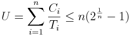

# Exercise 9 - Scheduling

## Properties

### Task 1:
 1. Why do we assign priorities to tasks?
      For å sikre at viktige oppgaver blir utført i tide, og vi vet best
 2. What features must a scheduler have for it to be usable for real-time systems?
      Må vite om tidsfrister, resurs begrensninger, statisk og dynamisk prioritering

## Inversion and inheritance

| Task | Priority   | Execution sequence | Release time |
|------|------------|--------------------|--------------|
| a    | 3          | `E Q V E`          | 4            |
| b    | 2          | `E V V E E E`      | 2            |
| c    | 1 (lowest) | `E Q Q Q E`        | 0            |

 - `E` : Executing
 - `Q` : Executing with resource Q locked
 - `V` : Executing with resource V locked

### Task 2: Draw Gantt charts to show how the former task set:
 1. Without priority inheritance
 2. With priority inheritance

### Task 3: Explain:
 1. What is priority inversion? What is unbounded priority inversion?
 3. Does priority inheritance avoid deadlocks?

## Utilization and response time

### Task set 2:

| Task | Period (T) | Exec. Time (C) |
|------|------------|----------------|
| a    | 50         | 15             |
| b    | 30         | 10             |
| c    | 20         | 5              |

### Task 4:
 1. There are a number of assumptions/conditions that must be true for the utilization and response time tests to be usable (The "simple task model"). What are these assumptions? Comment on how realistic they are.
 2. Perform the utilization test for the task set. Is the task set schedulable?
 3. Perform response-time analysis for the task set. Is the task set schedulable? If you got different results than in 2), explain why.
 4. (Optional) Draw a Gantt chart to show how the task set executes using rate monotonic priority assignment, and verify that your conclusions are correct.

## Formulas

Utilization:  

Response-time:  

