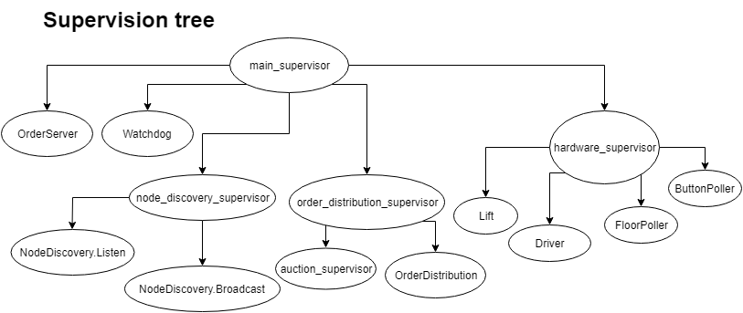

# LiftProject
Our lift project is written in Elixir, a functional programming language. The authors are Torbjørn Fuglestad, Ole-Jørgen Hannestad and Simen Krantz Knudsen.

For the extensive specifications for the project, see the [course project site](https://github.com/TTK4145/Project).

Our distribution system for orders relies on the concept of auctions and bids, where the lift with the lowest cost for the respective order will be assigned the order. In addition, all orders are assigned a watchdog in the form of another node in the network. If the order isn't completed within a specific time, it's redistributed.

## File descriptions
###### I/O Poller
Handles all of input and outputs, eg. polling floor- and button sensors.
###### Lift
Takes care of basic lift performance, driving the lift towards a specific order and stopping when reaching a wanted floor.
###### Network Handler
Performs network handling, eg. booting nodes and controlling the UDP client/server. We use UDP for discovery of new nodes.
###### Order Distribution
Distributes orders to nodes based on a cost calculation in addition to redistributing orders given from the watchdog.
###### Order Server
Keeps track of orders collected from Order Distribution, in addition to setting hall lights and calculating the cost of a given order for the respective lift.
###### Order
Sets the structure of an order in addition to tests if order is at a given floor.
###### Watchdog
Takes care of any order not being handled within reasonable time, set by the timer length @watchdog_timer.
###### File back up
Reads and writes to file to keep a record of the current and previous states.

## Supervision
The supervision tree implemented, is shown below.



## Assumptions
###### Functional
- No multiple simultaneous errors.
- At least one lift is always working normally.
- A person ordering the lift down will follow up with a cab call below for optimal performance from the system.
- Since the use of the obstruction switch and stop button is optional, we have chosen to not add this to our project.
###### Code design
- Since private functions can't be accessed externally, Elixir will warn if a private function has a @doc attribute and will discard its content. We have therefore excluded docs and other comments regarding implementation of functions in private functions.
- Further design is based on the given [requirements](https://github.com/TTK4145/Project2018/blob/master/EVALUATION.md#code-evaluation).
- Documentation for point of entry can be found in "Application" as this is the module that is called first.

## Dependencies
- Elevator Server

## Accreditations
Snippets of Jostein Løwer's code at his [repository](https://github.com/jostlowe/kokeplata) has been used as inspiration in some of our modules. There are also some functions from his examples which are used directly. For more details on Jostein's code, see the documentation.

## Installation
If [available in Hex](https://hex.pm/docs/publish), the package can be installed
by adding `lift_project` to your list of dependencies in `mix.exs`:

```elixir
def deps do
  [
    {:lift_project, "~> 0.1.0"}
  ]
end
```

Documentation can be generated with [ExDoc](https://github.com/elixir-lang/ex_doc)
and published on [HexDocs](https://hexdocs.pm). Once published, the docs can
be found at [https://hexdocs.pm/lift_project](https://hexdocs.pm/lift_project).
